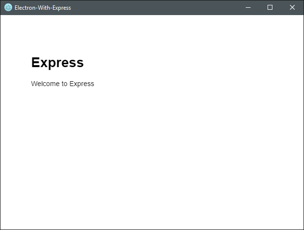
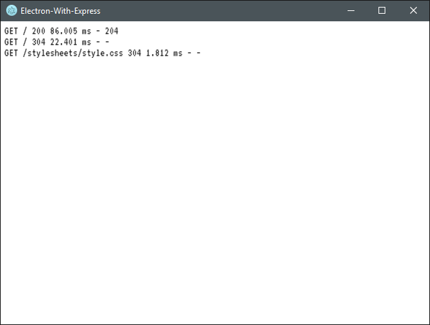

# electron-with-express

A simple project demonstrating how to spawn an Express app from Electron as well
as providing server logs directly in the Electron app.

Express App:



Press `Alt+CommandOrControl+L` to show the server log:



## Additional Information

The `express-app` folder is just a vanilla Express generated app using
`express-generator`. Actually, this used to be the case but I moved the default
routes from the routes folder to the root to make it a little easier to follow.

## Dependencies

- Node [https://nodejs.org/]

## How to run

1. Clone the code repository.
2. Open terminal to code repository.
3. Run `npm install`. (See Dependencies above)
4. Change directories to the express-app folder and run `npm install`.
5. Change directories back to the root of the code repository.
6. Run `npm start` to start the application.

## Package with Electron-Packager

If you would like to package this using `electron-packager` you'll need to
make the following change:

In index.html (line ~65):

```javascript
app = require("electron").remote.app),
node = spawn(".\\node_modules\\node\\bin\\node.exe", ["./express-app/bin/www"], {
  cwd: app.getAppPath()
});
```

This makes sure the path to our local copy of `node.exe` is correct when we run
electron to start the app.

That said, I'm assuming the platform is Windows. If other platforms are
desirable additional changes are required.

## Package with Electron-Packager (ASAR)

In this scenario you will not need to have Node.exe and Node.lib like the README
states. Using `child_process.fork` instead of `child_process.spawn` allows our
code to work in exactly the same way but Electron will be used to spawn a new
process for the Express server instead of our copy of Node.

In `index.html` around line 64 change the code to:

```javascript
app = require("electron").remote.app),
node = require("child_process").fork(
    `${app.getAppPath()}/express-app/bin/www`,
    [],
    {
      stdio: ["pipe", "pipe", "pipe", "ipc"]
    };
```

You can then package the code up using the command line:

```text
electron-packager . --overwrite --platform=win32 --arch=x64 --prune=true --out=release-builds --version-string.CompanyName=CE --version-string.FileDescription=CE --version-string.ProductName=\"Electron-With-Express\" --asar
```

## Author(s)

Frank Hale &lt;frankhale@gmail.com&gt;

Updated on: 16 January 2021

## License

MIT - see [LICENSE](LICENSE)
