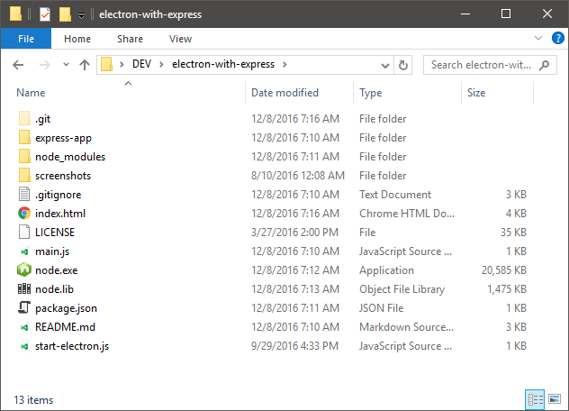
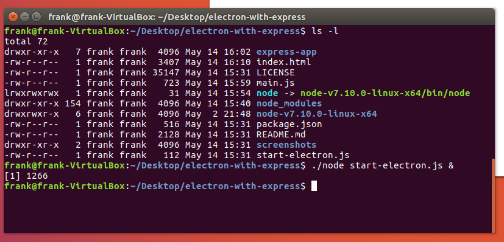

# electron-with-express

A simple project demonstrating how to spawn an Express app from Electron as well
as providing server logs directly in the Electron app.

Express App:


Press 'F1' to show the server log:


## Dependencies

#### Before start: Please note that this approach is intended to use in windows platform, any other OS approach would need some changes, contributions are very welcome

We'll need a copy of the `Node.exe` and `Node.lib`: [https://nodejs.org/dist/v9.4.0/win-x64/](https://nodejs.org/dist/v9.4.0/win-x64/)

After downloading a copy of this repository place them in the root of the code
folder. When the Electron app starts it will spawn the Express app using an external copy of Node. This allows the Express app to run outside the Electron process.

Here is a screenshot of the file layout:



## Additional Information

The `express-app` folder is just a vanilla Express generated app using
`express-generator`. Actually, this used to be the case but I moved the default routes from the routes folder to the root to make it a little easier to follow.

## How to run

1.  Clone the code repository.
2.  Open terminal to code repository.
3.  Make sure a copy of `Node.exe` and `Node.lib` are copied to the root of the
    code repository.
4.  Run `npm install`. (See Dependencies above)
5.  Change directories to the express-app folder and run `npm install`.
6.  Change directories back to the root of the code repository.
7.  Run `npm start` to start the application.

## Package with Electron-Packager

If you would like to package this using `electron-packager` you'll need to
make the following change:

In index.html (line ~65):

```javascript
app = require("electron").remote.app),
node = spawn(".\\node.exe", ["./express-app/bin/www"], {
  cwd: app.getAppPath()
});
```

This makes sure the path to our local copy of `node.exe` is correct when we run electron to start the app.

That said, I'm assuming the platform is Windows. If other platforms are desirable additional changes are required.

## Package with Electron-Packager (ASAR)

In this scenario you will not need to have Node.exe and Node.lib like the README states. Using `child_process.fork` instead of `child_process.spawn` allows our code to work in exactly the same way but Electron will be used to spawn a new process for the Express server instead of our copy of Node.

In `index.html` around line 64 change the code to:

```javascript
(app = require("electron").remote.app),
  (node = require("child_process").fork(
    `${app.getAppPath()}/express-app/bin/www`,
    [],
    {
      stdio: ["pipe", "pipe", "pipe", "ipc"]
    }
  ));
```

You can then package the code up using the command line:

```
electron-packager . --overwrite --platform=win32 --arch=x64 --prune=true --out=release-builds --version-string.CompanyName=CE --version-string.FileDescription=CE --version-string.ProductName=\"Electron-With-Express\" --asar
```

## Running on Linux

Download standalone distribution of Node:
[https://nodejs.org/dist/v9.4.0/node-v9.4.0-linux-x64.tar.gz](https://nodejs.org/dist/v9.4.0/node-v9.4.0-linux-x64.tar.gz)

Unpack it into the root of the cloned repository. Then create a symbolic link called 'node' at the same location.

```
ln -sf node-v9.4.0-linux-x64/bin/node node
```

Here is a screenshot of what it should look like:



Change line 65 in index.html to the following:

```javascript
node = spawn("./node", ["./express-app/bin/www"], { cwd: process.cwd() });
```

Then you can run it like this:

```
./node start-electron.js &
```

Or edit the scripts section in 'package.json' and change it to:

```json
  "scripts": {
    "start": "./node start-electron.js"
  },
```

Then run

```
npm start
```

## Running on OSX

* Download node binaries for OSX and extract the files.
* Copy the file called "node" into the root folder. There is no need of any other file (node.lib)

In **index.html** change the line

```
node = spawn(".\\node", ["./express-app/bin/www"], {
```

to

```
node = spawn("./node", ["./express-app/bin/www"], {
```

In **package.json** change the line

```
"start": ".\\node start-electron.js"
```

to

```
"start": "./node start-electron.js"
```

Then run

```
npm start
```

## Author(s)

Frank Hale &lt;frankhale@gmail.com&gt;
30 April 2018

## License

MIT - see [LICENSE](LICENSE)
